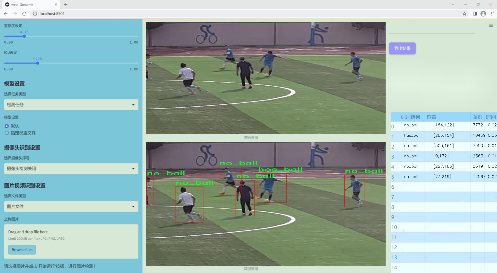
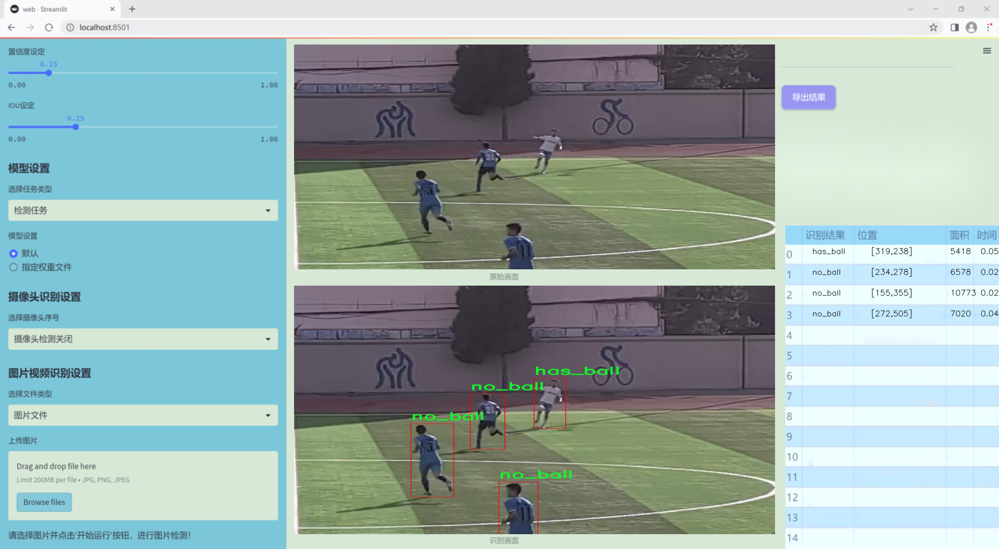
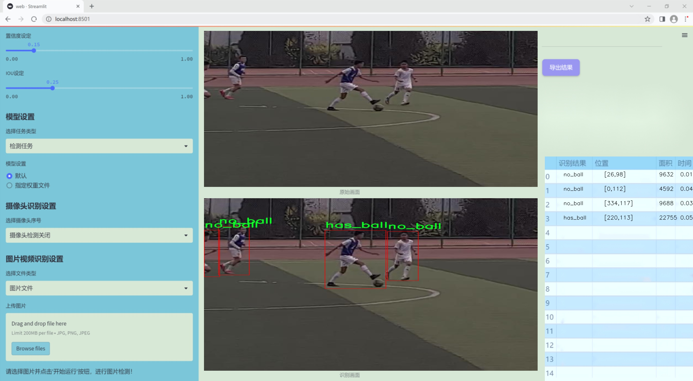
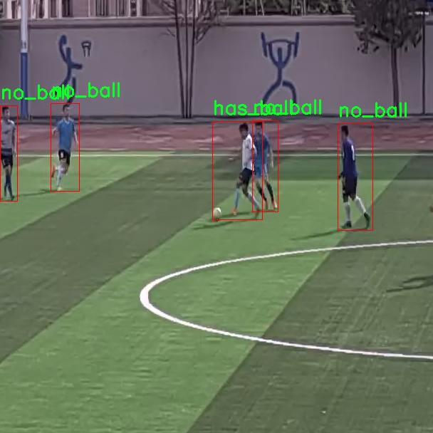
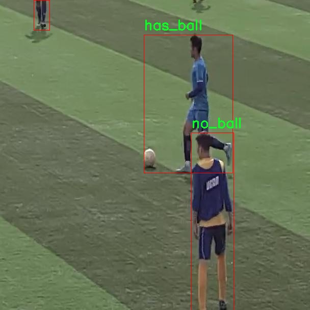
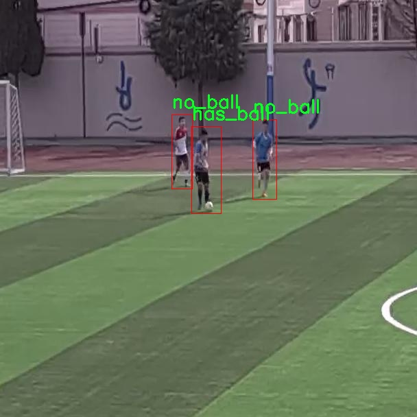
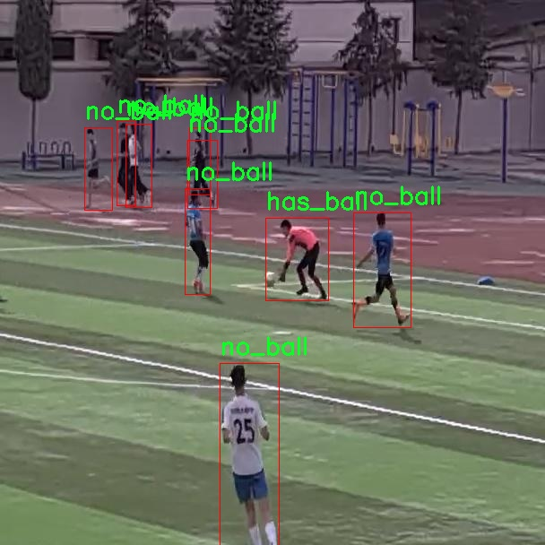
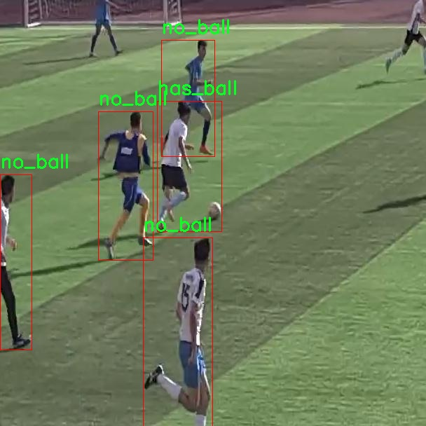

# 改进yolo11-fasternet等200+全套创新点大全：足球场上球检测系统源码＆数据集全套

### 1.图片效果展示







##### 项目来源 **[人工智能促进会 2024.11.03](https://kdocs.cn/l/cszuIiCKVNis)**

注意：由于项目一直在更新迭代，上面“1.图片效果展示”和“2.视频效果展示”展示的系统图片或者视频可能为老版本，新版本在老版本的基础上升级如下：（实际效果以升级的新版本为准）

  （1）适配了YOLOV11的“目标检测”模型和“实例分割”模型，通过加载相应的权重（.pt）文件即可自适应加载模型。

  （2）支持“图片识别”、“视频识别”、“摄像头实时识别”三种识别模式。

  （3）支持“图片识别”、“视频识别”、“摄像头实时识别”三种识别结果保存导出，解决手动导出（容易卡顿出现爆内存）存在的问题，识别完自动保存结果并导出到tempDir中。

  （4）支持Web前端系统中的标题、背景图等自定义修改。

  另外本项目提供训练的数据集和训练教程,暂不提供权重文件（best.pt）,需要您按照教程进行训练后实现图片演示和Web前端界面演示的效果。

### 2.视频效果展示

[2.1 视频效果展示](https://www.bilibili.com/video/BV13ESyYVE2w/)

### 3.背景

研究背景与意义

随着计算机视觉技术的快速发展，物体检测在多个领域中得到了广泛应用，尤其是在体育赛事分析中。足球作为全球最受欢迎的运动之一，其比赛过程中的动态变化和复杂场景为物体检测技术提出了更高的要求。传统的图像处理方法在实时性和准确性方面往往难以满足需求，因此，基于深度学习的物体检测算法逐渐成为研究的热点。YOLO（You Only Look Once）系列模型因其高效的检测速度和良好的准确性而被广泛应用于实时物体检测任务中。

本研究旨在基于改进的YOLOv11模型，构建一个专门用于足球场上球检测的系统。该系统将利用一个包含1200张图像的数据集，其中标注了“has_ball”和“no_ball”两个类别，旨在提高对足球在比赛中出现状态的检测能力。通过对该数据集的深入分析和模型的优化，期望能够实现对足球在复杂场景下的准确识别，为教练员和分析师提供实时的数据支持，进而提升战术分析和比赛策略的制定。

此外，随着足球比赛的不断发展，如何利用先进的技术手段提升比赛的观赏性和竞技水平，已成为体育科技研究的重要方向。基于YOLOv11的足球场上球检测系统不仅可以为实时比赛分析提供技术支持，还能够为后续的智能裁判系统、运动员表现评估等应用奠定基础。因此，本研究具有重要的理论价值和实际应用意义，能够推动足球赛事分析的智能化进程，为未来的体育科技发展提供新的思路和方法。

### 4.数据集信息展示

##### 4.1 本项目数据集详细数据（类别数＆类别名）

nc: 3
names: ['-', 'has_ball', 'no_ball']


该项目为【目标检测】数据集，请在【训练教程和Web端加载模型教程（第三步）】这一步的时候按照【目标检测】部分的教程来训练

##### 4.2 本项目数据集信息介绍

本项目数据集信息介绍

本项目所使用的数据集名为“soccer data”，旨在为改进YOLOv11的足球场上球检测系统提供高质量的训练数据。该数据集专注于足球比赛中的关键元素，特别是与球的状态相关的检测任务。数据集中包含三种类别，分别为“has_ball”（有球）、“no_ball”（无球）以及一个占位符类别“-”，用于标识未定义或不相关的图像区域。这种分类方式使得模型能够在复杂的比赛场景中有效地区分球的存在与否，从而提高检测的准确性和实时性。

“soccer data”数据集的构建过程经过精心设计，涵盖了多种比赛环境和光照条件，以确保模型在不同情况下的鲁棒性。数据集中包含大量标注清晰的图像，涵盖了各种角度和距离的拍摄，真实反映了足球场上的动态场景。通过对这些图像进行标注，数据集为模型提供了丰富的学习样本，使其能够捕捉到球在比赛中的不同状态及其与球员的相互作用。

此外，数据集的多样性还体现在不同比赛阶段的场景，包括进攻、防守以及球员之间的互动等。这些因素不仅增加了数据集的复杂性，也为模型的训练提供了更为全面的背景信息，促使其在实际应用中具备更强的适应能力。通过使用“soccer data”数据集，我们期望能够显著提升YOLOv11在足球场上球检测的性能，为后续的研究和应用奠定坚实的基础。











### 5.全套项目环境部署视频教程（零基础手把手教学）

[5.1 所需软件PyCharm和Anaconda安装教程（第一步）](https://www.bilibili.com/video/BV1BoC1YCEKi/?spm_id_from=333.999.0.0&vd_source=bc9aec86d164b67a7004b996143742dc)


[5.2 安装Python虚拟环境创建和依赖库安装视频教程（第二步）](https://www.bilibili.com/video/BV1ZoC1YCEBw?spm_id_from=333.788.videopod.sections&vd_source=bc9aec86d164b67a7004b996143742dc)

### 6.改进YOLOv11训练教程和Web_UI前端加载模型教程（零基础手把手教学）

[6.1 改进YOLOv11训练教程和Web_UI前端加载模型教程（第三步）](https://www.bilibili.com/video/BV1BoC1YCEhR?spm_id_from=333.788.videopod.sections&vd_source=bc9aec86d164b67a7004b996143742dc)


按照上面的训练视频教程链接加载项目提供的数据集，运行train.py即可开始训练



     Epoch   gpu_mem       box       obj       cls    labels  img_size
     1/200     20.8G   0.01576   0.01955  0.007536        22      1280: 100%|██████████| 849/849 [14:42<00:00,  1.04s/it]
               Class     Images     Labels          P          R     mAP@.5 mAP@.5:.95: 100%|██████████| 213/213 [01:14<00:00,  2.87it/s]
                 all       3395      17314      0.994      0.957      0.0957      0.0843

     Epoch   gpu_mem       box       obj       cls    labels  img_size
     2/200     20.8G   0.01578   0.01923  0.007006        22      1280: 100%|██████████| 849/849 [14:44<00:00,  1.04s/it]
               Class     Images     Labels          P          R     mAP@.5 mAP@.5:.95: 100%|██████████| 213/213 [01:12<00:00,  2.95it/s]
                 all       3395      17314      0.996      0.956      0.0957      0.0845

     Epoch   gpu_mem       box       obj       cls    labels  img_size
     3/200     20.8G   0.01561    0.0191  0.006895        27      1280: 100%|██████████| 849/849 [10:56<00:00,  1.29it/s]
               Class     Images     Labels          P          R     mAP@.5 mAP@.5:.95: 100%|███████   | 187/213 [00:52<00:00,  4.04it/s]
                 all       3395      17314      0.996      0.957      0.0957      0.0845


###### [项目数据集下载链接](https://kdocs.cn/l/cszuIiCKVNis)

### 7.原始YOLOv11算法讲解


YOLO11 是 Ultralytics YOLO 系列的最新版本，结合了尖端的准确性、速度和效率，用于目标检测、分割、分类、定向边界框和姿态估计。与
YOLOv8 相比，它具有更少的参数和更好的结果，不难预见，YOLO11 在边缘设备上更高效、更快，将频繁出现在计算机视觉领域的最先进技术（SOTA）中。


**主要特点**

  * **增强的特征提取：**YOLO11 使用改进的主干和颈部架构来增强特征提取，以实现更精确的目标检测和复杂任务的性能。

  * **针对效率和速度优化：**精细的架构设计和优化的训练流程在保持准确性和性能之间最佳平衡的同时，提供更快的处理速度。

  * **更少的参数，更高的准确度：**YOLO11m 在 COCO 数据集上实现了比 YOLOv8m 更高的 mAP，参数减少了 22%，提高了计算效率，同时不牺牲准确度。

  * **跨环境的适应性：**YOLO11 可以无缝部署在边缘设备、云平台和配备 NVIDIA GPU 的系统上，确保最大的灵活性。

  * **支持广泛的任务范围：**YOLO11 支持各种计算机视觉任务，如目标检测、实例分割、图像分类、姿态估计和定向目标检测（OBB）。


### 8.200+种全套改进YOLOV11创新点原理讲解

#### 8.1 200+种全套改进YOLOV11创新点原理讲解大全

由于篇幅限制，每个创新点的具体原理讲解就不全部展开，具体见下列网址中的改进模块对应项目的技术原理博客网址【Blog】（创新点均为模块化搭建，原理适配YOLOv5~YOLOv11等各种版本）

[改进模块技术原理博客【Blog】网址链接](https://gitee.com/qunmasj/good)


#### 8.2 精选部分改进YOLOV11创新点原理讲解

###### 这里节选部分改进创新点展开原理讲解(完整的改进原理见上图和[改进模块技术原理博客链接](https://gitee.com/qunmasj/good)【如果此小节的图加载失败可以通过CSDN或者Github搜索该博客的标题访问原始博客，原始博客图片显示正常】

### 可扩张残差（DWR）注意力模块
当前的许多工作直接采用多速率深度扩张卷积从一个输入特征图中同时捕获多尺度上下文信息，从而提高实时语义分割的特征提取效率。 然而，这种设计可能会因为结构和超参数的不合理而导致多尺度上下文信息的访问困难。 为了降低绘制多尺度上下文信息的难度，我们提出了一种高效的多尺度特征提取方法，该方法分解了原始的单步特征提取方法方法分为两个步骤，区域残差-语义残差。 在该方法中，多速率深度扩张卷积在特征提取中发挥更简单的作用：根据第一步提供的每个简明区域形式特征图，在第二步中使用一个所需的感受野执行简单的基于语义的形态过滤 一步，提高他们的效率。 此外，扩张率和扩张卷积的容量每个网络阶段都经过精心设计，以充分利用所有可以实现的区域形式的特征图。 因此，我们分别为高层和低层网络设计了一种新颖的扩张式残差（DWR）模块和简单倒置残差（SIR）模块。


首先，该博客引入了一个Dilation-wise Residual（DWR）模块，用于提取网络高层的特征，如图2a所示。多分支结构用于扩展感受野，其中每个分支采用不同空洞率的空洞深度卷积。
然后，专门设计了一个Simple Inverted Residual（SIR）模块来提取网络低层的特征，如图2b所示。该模块仅具有3×3的微小感受野，但使用inverted bottleneck式结构来扩展通道数量，确保更强的特征提取能力。
最后，基于DWR和SIR模块，构建了一个编码器-解码器风格的网络DWRSeg，其中解码器采用了简单的类似FCN的结构。解码器使用来自最后两个阶段的强语义信息直接对特征图进行上采样，然后将它们与来自较低阶段的特征图（包含丰富的详细信息）拼接起来，以进行最终预测。


### 9.系统功能展示

图9.1.系统支持检测结果表格显示

  图9.2.系统支持置信度和IOU阈值手动调节

  图9.3.系统支持自定义加载权重文件best.pt(需要你通过步骤5中训练获得)

  图9.4.系统支持摄像头实时识别

  图9.5.系统支持图片识别

  图9.6.系统支持视频识别

  图9.7.系统支持识别结果文件自动保存

  图9.8.系统支持Excel导出检测结果数据


### 10. YOLOv11核心改进源码讲解

#### 10.1 wtconv2d.py

以下是经过精简和注释的核心代码，保留了主要的功能和结构，去掉了冗余部分：

```python
import torch
import torch.nn as nn
import torch.nn.functional as F
import pywt

def create_wavelet_filter(wave, in_size, out_size, type=torch.float):
    # 创建小波滤波器
    w = pywt.Wavelet(wave)
    # 生成小波分解和重构滤波器
    dec_lo = torch.tensor(w.dec_lo[::-1], dtype=type)
    dec_hi = torch.tensor(w.dec_hi[::-1], dtype=type)
    
    # 组合滤波器
    dec_filters = torch.stack([
        dec_lo.unsqueeze(0) * dec_lo.unsqueeze(1),
        dec_lo.unsqueeze(0) * dec_hi.unsqueeze(1),
        dec_hi.unsqueeze(0) * dec_lo.unsqueeze(1),
        dec_hi.unsqueeze(0) * dec_hi.unsqueeze(1)
    ], dim=0).repeat(in_size, 1, 1, 1)

    rec_filters = torch.stack([
        dec_lo.unsqueeze(0) * dec_lo.unsqueeze(1),
        dec_lo.unsqueeze(0) * dec_hi.unsqueeze(1),
        dec_hi.unsqueeze(0) * dec_lo.unsqueeze(1),
        dec_hi.unsqueeze(0) * dec_hi.unsqueeze(1)
    ], dim=0).repeat(out_size, 1, 1, 1)

    return dec_filters, rec_filters

def wavelet_transform(x, filters):
    # 小波变换
    b, c, h, w = x.shape
    pad = (filters.shape[2] // 2 - 1, filters.shape[3] // 2 - 1)
    x = F.conv2d(x, filters.to(x.dtype).to(x.device), stride=2, groups=c, padding=pad)
    return x.reshape(b, c, 4, h // 2, w // 2)

def inverse_wavelet_transform(x, filters):
    # 小波逆变换
    b, c, _, h_half, w_half = x.shape
    pad = (filters.shape[2] // 2 - 1, filters.shape[3] // 2 - 1)
    x = x.reshape(b, c * 4, h_half, w_half)
    return F.conv_transpose2d(x, filters.to(x.dtype).to(x.device), stride=2, groups=c, padding=pad)

class WaveletTransform(Function):
    @staticmethod
    def forward(ctx, input, filters):
        ctx.filters = filters
        return wavelet_transform(input, filters)

    @staticmethod
    def backward(ctx, grad_output):
        return inverse_wavelet_transform(grad_output, ctx.filters), None

class WTConv2d(nn.Module):
    def __init__(self, in_channels, out_channels, wt_levels=1, wt_type='db1'):
        super(WTConv2d, self).__init__()
        assert in_channels == out_channels
        self.wt_levels = wt_levels
        
        # 创建小波滤波器
        self.wt_filter, self.iwt_filter = create_wavelet_filter(wt_type, in_channels, in_channels)
        self.wt_function = WaveletTransform.apply
        self.iwt_function = WaveletTransform.apply

        # 基础卷积层
        self.base_conv = nn.Conv2d(in_channels, in_channels, kernel_size=5, padding='same', stride=1, groups=in_channels)

        # 小波卷积层
        self.wavelet_convs = nn.ModuleList(
            [nn.Conv2d(in_channels * 4, in_channels * 4, kernel_size=5, padding='same', stride=1, groups=in_channels * 4) for _ in range(self.wt_levels)]
        )

    def forward(self, x):
        # 前向传播
        x_ll_in_levels = []
        x_h_in_levels = []

        curr_x_ll = x
        for i in range(self.wt_levels):
            curr_x = self.wt_function(curr_x_ll, self.wt_filter)
            x_ll_in_levels.append(curr_x[:, :, 0, :, :])
            x_h_in_levels.append(curr_x[:, :, 1:4, :, :])
            curr_x_ll = curr_x[:, :, 0, :, :]

        # 逆小波变换
        next_x_ll = 0
        for i in range(self.wt_levels - 1, -1, -1):
            curr_x_ll = x_ll_in_levels.pop()
            curr_x_h = x_h_in_levels.pop()
            curr_x = torch.cat([curr_x_ll.unsqueeze(2), curr_x_h], dim=2)
            next_x_ll = self.iwt_function(curr_x, self.iwt_filter)

        # 基础卷积
        x = self.base_conv(x) + next_x_ll
        return x
```

### 代码说明
1. **create_wavelet_filter**: 生成小波变换所需的滤波器，包括分解和重构滤波器。
2. **wavelet_transform**: 实现小波变换，使用卷积操作将输入信号分解为低频和高频部分。
3. **inverse_wavelet_transform**: 实现小波逆变换，将低频和高频部分合并回原始信号。
4. **WaveletTransform**: 定义小波变换的前向和反向传播过程。
5. **WTConv2d**: 自定义卷积层，结合小波变换和卷积操作，进行特征提取。

这个简化版本保留了小波变换的核心功能，并提供了必要的注释以帮助理解每个部分的作用。

这个程序文件 `wtconv2d.py` 实现了一个基于小波变换的二维卷积层，主要用于深度学习中的图像处理任务。文件中使用了 PyTorch 框架，结合了小波变换的概念来进行卷积操作，以便提取图像的多尺度特征。

首先，文件导入了必要的库，包括 PyTorch、PyWavelets（用于小波变换）和一些其他工具。接着，定义了几个辅助函数。`create_wavelet_filter` 函数用于创建小波变换的滤波器，接受小波类型、输入通道数和输出通道数作为参数。该函数生成了小波的分解和重构滤波器，并将其转换为 PyTorch 张量。

`wavelet_transform` 和 `inverse_wavelet_transform` 函数分别实现了小波变换和逆小波变换的操作。它们通过卷积操作对输入张量进行处理，提取不同频率的信息。

接下来，定义了两个类 `WaveletTransform` 和 `InverseWaveletTransform`，它们继承自 `torch.autograd.Function`。这两个类分别实现了小波变换和逆变换的前向和反向传播方法，使得在训练过程中可以自动计算梯度。

`wavelet_transform_init` 和 `inverse_wavelet_transform_init` 函数用于初始化小波变换和逆变换的操作，返回一个应用函数。

然后，定义了 `WTConv2d` 类，这是整个文件的核心部分，继承自 `nn.Module`。在初始化方法中，首先检查输入和输出通道数是否相等。接着，创建小波变换和逆变换的滤波器，并将其设置为不可训练的参数。该类还定义了基本的卷积层和小波卷积层，并通过 `_ScaleModule` 类实现了缩放操作。

在 `forward` 方法中，输入数据经过多层小波变换和逆变换的处理，提取出不同层次的特征。每一层的小波变换都将输入信号分解为低频和高频部分，经过卷积和缩放后再进行逆变换，最终将所有层的结果合并。

最后，`_ScaleModule` 类用于实现一个简单的缩放操作，它的前向方法将输入乘以一个可训练的权重。

总体而言，这个文件实现了一个复杂的卷积层，通过结合小波变换的特性，能够有效地处理图像数据，提取多尺度特征，适用于各种深度学习任务。

#### 10.2 CSwomTramsformer.py

以下是提取后的核心代码部分，并附上详细的中文注释：

```python
import torch
import torch.nn as nn
import torch.nn.functional as F
import numpy as np

class Mlp(nn.Module):
    """多层感知机（MLP）模块"""
    def __init__(self, in_features, hidden_features=None, out_features=None, act_layer=nn.GELU, drop=0.):
        super().__init__()
        out_features = out_features or in_features  # 输出特征数默认为输入特征数
        hidden_features = hidden_features or in_features  # 隐藏层特征数默认为输入特征数
        self.fc1 = nn.Linear(in_features, hidden_features)  # 第一层线性变换
        self.act = act_layer()  # 激活函数
        self.fc2 = nn.Linear(hidden_features, out_features)  # 第二层线性变换
        self.drop = nn.Dropout(drop)  # Dropout层

    def forward(self, x):
        """前向传播"""
        x = self.fc1(x)  # 线性变换
        x = self.act(x)  # 激活
        x = self.drop(x)  # Dropout
        x = self.fc2(x)  # 线性变换
        x = self.drop(x)  # Dropout
        return x

class CSWinBlock(nn.Module):
    """CSWin Transformer的基本块"""
    def __init__(self, dim, num_heads, mlp_ratio=4., drop=0., attn_drop=0., norm_layer=nn.LayerNorm):
        super().__init__()
        self.dim = dim  # 输入特征维度
        self.num_heads = num_heads  # 注意力头数
        self.mlp_ratio = mlp_ratio  # MLP的隐藏层比率
        self.qkv = nn.Linear(dim, dim * 3)  # 线性变换用于生成Q、K、V
        self.norm1 = norm_layer(dim)  # 归一化层

        # 注意力层
        self.attn = LePEAttention(dim, num_heads=num_heads, attn_drop=attn_drop)

        # MLP层
        mlp_hidden_dim = int(dim * mlp_ratio)  # 隐藏层维度
        self.mlp = Mlp(in_features=dim, hidden_features=mlp_hidden_dim, out_features=dim)  # MLP模块
        self.norm2 = norm_layer(dim)  # 归一化层

    def forward(self, x):
        """前向传播"""
        img = self.norm1(x)  # 归一化
        qkv = self.qkv(img).reshape(x.shape[0], -1, 3, self.dim).permute(2, 0, 1, 3)  # 生成Q、K、V
        x = self.attn(qkv)  # 注意力计算
        x = x + self.drop_path(x)  # 残差连接
        x = x + self.drop_path(self.mlp(self.norm2(x)))  # 残差连接
        return x

class CSWinTransformer(nn.Module):
    """CSWin Transformer模型"""
    def __init__(self, img_size=640, in_chans=3, num_classes=1000, embed_dim=96, depth=[2,2,6,2], num_heads=12):
        super().__init__()
        self.num_classes = num_classes
        self.embed_dim = embed_dim  # 嵌入维度

        # 输入嵌入层
        self.stage1_conv_embed = nn.Sequential(
            nn.Conv2d(in_chans, embed_dim, 7, 4, 2),  # 卷积层
            nn.LayerNorm(embed_dim)  # 归一化层
        )

        # 构建多个CSWinBlock
        self.stage1 = nn.ModuleList([
            CSWinBlock(dim=embed_dim, num_heads=num_heads) for _ in range(depth[0])
        ])

        # 其他阶段的构建省略...

    def forward(self, x):
        """前向传播"""
        x = self.stage1_conv_embed(x)  # 输入嵌入
        for blk in self.stage1:
            x = blk(x)  # 通过每个CSWinBlock
        return x

# 示例：创建CSWinTransformer模型并进行前向传播
if __name__ == '__main__':
    inputs = torch.randn((1, 3, 640, 640))  # 随机输入
    model = CSWinTransformer()  # 创建模型
    res = model(inputs)  # 前向传播
    print(res.size())  # 输出结果的尺寸
```

### 代码注释说明：
1. **Mlp类**：实现了一个简单的多层感知机，包括两个线性层和激活函数，支持Dropout。
2. **CSWinBlock类**：构建了CSWin Transformer的基本块，包含了注意力机制和MLP层，并实现了残差连接。
3. **CSWinTransformer类**：定义了整个CSWin Transformer模型，包含输入嵌入层和多个CSWinBlock。
4. **前向传播**：在`forward`方法中，输入经过嵌入层和多个块的处理，最终输出特征。

### 注意：
为了保持代码的简洁性，省略了一些细节实现（如`LePEAttention`类和其他阶段的构建），但保留了模型的核心结构和逻辑。

这个程序文件实现了一个名为 CSWin Transformer 的视觉变换器模型，主要用于图像分类等计算机视觉任务。该模型由微软公司开发，代码中包含了多种模块和功能，下面对其进行详细说明。

首先，文件中导入了必要的库，包括 PyTorch、timm（一个用于图像模型的库）、einops（用于重排张量的库）等。接着，定义了一些全局变量和模型名称，以便后续使用。

程序的核心部分是多个类的定义。首先是 `Mlp` 类，它实现了一个多层感知机（MLP），包含两个线性层和一个激活函数（默认为 GELU），用于特征的非线性变换。

接下来是 `LePEAttention` 类，它实现了一种特殊的注意力机制，称为局部增强位置编码（LePE）。该类的构造函数中定义了多个参数，包括输入维度、分辨率、头数等。在 `forward` 方法中，输入的查询、键、值张量被转换为窗口格式，并计算注意力权重，最后输出经过加权的值。

`CSWinBlock` 类是模型的基本构建块，包含了注意力层和 MLP 层。它根据输入的分辨率和深度配置多个注意力层，并在每个阶段中应用归一化和残差连接。

`img2windows` 和 `windows2img` 函数用于将图像张量转换为窗口格式，以及将窗口格式的张量转换回图像格式，便于在注意力机制中处理。

`Merge_Block` 类用于在不同阶段之间合并特征，通常通过卷积层来减少特征图的尺寸。

`CSWinTransformer` 类是整个模型的主类，负责构建整个网络结构。它的构造函数中定义了输入参数，包括图像大小、补丁大小、通道数、类别数、嵌入维度、深度等。模型的不同阶段通过 `CSWinBlock` 和 `Merge_Block` 进行组合，并在每个阶段应用不同的注意力机制。

在 `forward_features` 方法中，输入图像经过多个阶段的处理，提取出不同层次的特征。最后，`forward` 方法返回这些特征。

此外，文件中还定义了一些辅助函数，如 `_conv_filter` 和 `update_weight`，用于处理模型权重的加载和转换。

最后，程序提供了四个不同规模的模型构造函数（`CSWin_tiny`、`CSWin_small`、`CSWin_base`、`CSWin_large`），可以根据需要选择不同的模型架构。主程序部分演示了如何实例化这些模型并进行前向推理，输出每个模型的特征图尺寸。

整体而言，这个程序实现了一个复杂的视觉变换器模型，结合了多种先进的深度学习技术，适用于各种计算机视觉任务。

#### 10.3 val.py

以下是代码中最核心的部分，并附上详细的中文注释：

```python
class DetectionValidator(BaseValidator):
    """
    DetectionValidator类用于基于检测模型的验证，继承自BaseValidator类。
    """

    def __init__(self, dataloader=None, save_dir=None, pbar=None, args=None, _callbacks=None):
        """初始化检测模型，设置必要的变量和参数。"""
        super().__init__(dataloader, save_dir, pbar, args, _callbacks)
        self.nt_per_class = None  # 每个类别的目标数量
        self.is_coco = False  # 是否为COCO数据集
        self.class_map = None  # 类别映射
        self.args.task = "detect"  # 设置任务为检测
        self.metrics = DetMetrics(save_dir=self.save_dir, on_plot=self.on_plot)  # 初始化检测指标
        self.iouv = torch.linspace(0.5, 0.95, 10)  # mAP@0.5:0.95的IoU向量
        self.niou = self.iouv.numel()  # IoU的数量
        self.lb = []  # 用于自动标注

    def preprocess(self, batch):
        """对YOLO训练的图像批次进行预处理。"""
        batch["img"] = batch["img"].to(self.device, non_blocking=True)  # 将图像移动到设备上
        batch["img"] = (batch["img"].half() if self.args.half else batch["img"].float()) / 255  # 归一化图像
        for k in ["batch_idx", "cls", "bboxes"]:
            batch[k] = batch[k].to(self.device)  # 将其他数据移动到设备上

        # 如果需要保存混合数据
        if self.args.save_hybrid:
            height, width = batch["img"].shape[2:]  # 获取图像的高度和宽度
            nb = len(batch["img"])  # 批次中的图像数量
            bboxes = batch["bboxes"] * torch.tensor((width, height, width, height), device=self.device)  # 调整边界框
            self.lb = (
                [
                    torch.cat([batch["cls"][batch["batch_idx"] == i], bboxes[batch["batch_idx"] == i]], dim=-1)
                    for i in range(nb)
                ]
                if self.args.save_hybrid
                else []
            )  # 为自动标注准备数据

        return batch  # 返回处理后的批次

    def postprocess(self, preds):
        """对预测输出应用非极大值抑制（NMS）。"""
        return ops.non_max_suppression(
            preds,
            self.args.conf,  # 置信度阈值
            self.args.iou,  # IoU阈值
            labels=self.lb,  # 标签
            multi_label=True,  # 多标签
            agnostic=self.args.single_cls,  # 是否单类
            max_det=self.args.max_det,  # 最大检测数量
        )

    def update_metrics(self, preds, batch):
        """更新指标统计信息。"""
        for si, pred in enumerate(preds):  # 遍历每个预测
            self.seen += 1  # 记录已处理的图像数量
            npr = len(pred)  # 当前预测的数量
            stat = dict(
                conf=torch.zeros(0, device=self.device),  # 置信度
                pred_cls=torch.zeros(0, device=self.device),  # 预测类别
                tp=torch.zeros(npr, self.niou, dtype=torch.bool, device=self.device),  # 真阳性
            )
            pbatch = self._prepare_batch(si, batch)  # 准备批次数据
            cls, bbox = pbatch.pop("cls"), pbatch.pop("bbox")  # 获取类别和边界框
            nl = len(cls)  # 目标数量
            stat["target_cls"] = cls  # 记录目标类别
            if npr == 0:  # 如果没有预测
                if nl:  # 如果有目标
                    for k in self.stats.keys():
                        self.stats[k].append(stat[k])  # 更新统计信息
                continue  # 跳过当前循环

            # 处理预测
            if self.args.single_cls:
                pred[:, 5] = 0  # 如果是单类，设置类别为0
            predn = self._prepare_pred(pred, pbatch)  # 准备预测数据
            stat["conf"] = predn[:, 4]  # 记录置信度
            stat["pred_cls"] = predn[:, 5]  # 记录预测类别

            # 评估
            if nl:  # 如果有目标
                stat["tp"] = self._process_batch(predn, bbox, cls)  # 处理批次
            for k in self.stats.keys():
                self.stats[k].append(stat[k])  # 更新统计信息

            # 保存预测结果
            if self.args.save_json:
                self.pred_to_json(predn, batch["im_file"][si])  # 保存为JSON格式
            if self.args.save_txt:
                file = self.save_dir / "labels" / f'{Path(batch["im_file"][si]).stem}.txt'  # 保存为TXT格式
                self.save_one_txt(predn, self.args.save_conf, pbatch["ori_shape"], file)

    def get_stats(self):
        """返回指标统计信息和结果字典。"""
        stats = {k: torch.cat(v, 0).cpu().numpy() for k, v in self.stats.items()}  # 转换为numpy格式
        if len(stats) and stats["tp"].any():  # 如果有真阳性
            self.metrics.process(**stats)  # 处理指标
        self.nt_per_class = np.bincount(
            stats["target_cls"].astype(int), minlength=self.nc
        )  # 计算每个类别的目标数量
        return self.metrics.results_dict  # 返回结果字典
```

### 代码核心部分说明：
1. **DetectionValidator类**：这是一个用于YOLO模型验证的类，继承自`BaseValidator`，主要负责处理检测任务的相关逻辑。
2. **初始化方法**：在初始化时设置了许多与检测相关的参数，包括类别映射、指标初始化等。
3. **预处理方法**：对输入的图像批次进行处理，包括归一化和将数据移动到指定设备。
4. **后处理方法**：应用非极大值抑制（NMS）来过滤预测结果，保留最优的检测框。
5. **更新指标方法**：在每次验证时更新统计信息，包括真阳性、置信度等，并保存预测结果。
6. **获取统计信息方法**：计算并返回每个类别的目标数量和其他相关指标的统计信息。

这些核心部分构成了YOLO模型验证的基础，确保了模型在验证集上的性能评估。

这个程序文件 `val.py` 是一个用于YOLO（You Only Look Once）目标检测模型验证的类，名为 `DetectionValidator`，它继承自 `BaseValidator` 类。该类的主要功能是对目标检测模型进行验证，计算各种性能指标，并生成相应的可视化结果。

在初始化方法 `__init__` 中，类会设置一些必要的变量和参数，包括模型的任务类型、度量标准、IOU（Intersection over Union）向量等。该类还定义了用于处理数据的多个方法，包括预处理图像、初始化度量标准、更新度量统计等。

`preprocess` 方法用于对输入的图像批次进行预处理，包括将图像转换为适合模型输入的格式，并根据需要进行归一化处理。`init_metrics` 方法则负责初始化评估指标，包括确定数据集是否为COCO格式，并设置相应的类别映射。

在验证过程中，`postprocess` 方法应用非极大值抑制（NMS）来过滤预测结果，确保最终输出的边界框是最优的。`update_metrics` 方法用于更新模型的性能指标，处理每个批次的预测结果和真实标签，并将结果保存到指定的文件中。

此外，类中还包含了用于构建数据集和数据加载器的方法，例如 `build_dataset` 和 `get_dataloader`，这些方法负责从指定路径加载图像并创建数据集对象。`plot_val_samples` 和 `plot_predictions` 方法用于可视化验证样本和模型的预测结果，生成相应的图像文件。

在最终结果的处理上，`finalize_metrics` 方法用于设置最终的度量速度和混淆矩阵，`get_stats` 方法返回性能统计数据，`print_results` 方法则打印每个类别的验证结果，包括检测到的图像数量、实例数量以及各种评估指标。

最后，`eval_json` 方法用于评估YOLO输出的JSON格式结果，并返回性能统计数据，特别是计算mAP（mean Average Precision）等指标。

总体而言，这个文件提供了一个完整的框架，用于对YOLO目标检测模型进行验证和评估，涵盖了数据预处理、指标计算、结果可视化等多个方面。

#### 10.4 block.py

以下是经过简化并添加详细中文注释的核心代码部分：

```python
import torch
import torch.nn as nn
import torch.nn.functional as F

def autopad(k, p=None, d=1):
    """自动填充以实现'same'形状输出"""
    if d > 1:
        k = d * (k - 1) + 1 if isinstance(k, int) else [d * (x - 1) + 1 for x in k]  # 实际的卷积核大小
    if p is None:
        p = k // 2 if isinstance(k, int) else [x // 2 for x in k]  # 自动填充
    return p

class Conv(nn.Module):
    """卷积层，包含卷积和批归一化"""
    def __init__(self, in_channels, out_channels, kernel_size=3, stride=1, padding=None, groups=1, act=True):
        super().__init__()
        self.conv = nn.Conv2d(in_channels, out_channels, kernel_size, stride, autopad(kernel_size, padding), groups=groups, bias=False)
        self.bn = nn.BatchNorm2d(out_channels)
        self.act = nn.SiLU() if act else nn.Identity()

    def forward(self, x):
        return self.act(self.bn(self.conv(x)))

class Bottleneck(nn.Module):
    """标准瓶颈结构"""
    def __init__(self, c1, c2, shortcut=True, g=1, k=(3, 3), e=0.5):
        super().__init__()
        c_ = int(c2 * e)  # 隐藏通道数
        self.cv1 = Conv(c1, c_, k[0], 1)  # 第一个卷积
        self.cv2 = Conv(c_, c2, k[1], 1, g=g)  # 第二个卷积
        self.add = shortcut and c1 == c2  # 是否使用shortcut连接

    def forward(self, x):
        """前向传播"""
        return x + self.cv2(self.cv1(x)) if self.add else self.cv2(self.cv1(x))

class C3k(nn.Module):
    """C3k模块，包含多个瓶颈结构"""
    def __init__(self, c1, c2, n=1, shortcut=False, g=1, e=0.5, k=3):
        super().__init__()
        self.m = nn.Sequential(*(Bottleneck(c1, c2, shortcut, g, k=(k, k), e=1.0) for _ in range(n)))

    def forward(self, x):
        """前向传播"""
        return self.m(x)

class DynamicConv(nn.Module):
    """动态卷积层"""
    def __init__(self, c1, c2, k=1, s=1, p=None, g=1, d=1, act=True):
        super().__init__()
        self.conv = nn.Sequential(
            nn.Conv2d(c1, c2, k, s, autopad(k, p, d), groups=g, bias=True),
            nn.BatchNorm2d(c2),
            nn.SiLU() if act else nn.Identity()
        )

    def forward(self, x):
        return self.conv(x)

class AttentionBlock(nn.Module):
    """注意力模块"""
    def __init__(self, dim, num_heads=8):
        super().__init__()
        self.num_heads = num_heads
        self.head_dim = dim // num_heads
        self.scale = self.head_dim ** -0.5
        self.qkv = nn.Conv2d(dim, dim * 3, kernel_size=1)
        self.proj = nn.Conv2d(dim, dim, kernel_size=1)

    def forward(self, x):
        B, C, H, W = x.shape
        qkv = self.qkv(x).reshape(B, 3, self.num_heads, self.head_dim, H * W).permute(0, 1, 3, 4, 2)
        q, k, v = qkv[0], qkv[1], qkv[2]
        attn = (q @ k.transpose(-2, -1)) * self.scale
        attn = attn.softmax(dim=-1)
        out = (attn @ v).reshape(B, C, H, W)
        return self.proj(out)

# 示例使用
class ExampleModel(nn.Module):
    def __init__(self):
        super().__init__()
        self.bottleneck = Bottleneck(3, 16)  # 输入通道3，输出通道16
        self.attention = AttentionBlock(16)  # 输入通道16

    def forward(self, x):
        x = self.bottleneck(x)
        x = self.attention(x)
        return x
```

### 代码说明
1. **`autopad`函数**：用于自动计算卷积的填充，使输出的尺寸与输入相同。
2. **`Conv`类**：定义了一个卷积层，包含卷积、批归一化和激活函数。
3. **`Bottleneck`类**：实现了标准的瓶颈结构，包含两个卷积层和可选的shortcut连接。
4. **`C3k`类**：是一个包含多个瓶颈结构的模块。
5. **`DynamicConv`类**：实现了动态卷积，适用于输入特征的动态处理。
6. **`AttentionBlock`类**：实现了一个简单的注意力机制，使用了多头注意力。
7. **`ExampleModel`类**：示例模型，展示了如何使用瓶颈和注意力模块。

### 注意事项
- 该代码段是原始代码的简化版本，保留了核心结构和功能。
- 详细的注释帮助理解每个部分的功能和作用。

这个 `block.py` 文件包含了多种深度学习模型组件的实现，主要是用于构建卷积神经网络（CNN）和变换器（Transformer）模型的模块。文件中使用了 PyTorch 框架，以下是对文件中主要内容的逐步说明。

首先，文件导入了必要的库，包括 PyTorch 的核心库、神经网络模块、功能模块、一些数学工具以及自定义的卷积模块和注意力机制模块。通过这些导入，文件可以使用深度学习中常用的各种操作和结构。

接下来，文件定义了一系列的卷积和注意力模块，包括 `autopad` 函数用于自动计算卷积的填充大小，确保输出尺寸与输入相同。然后，定义了多种激活函数，如 `swish`、`h_swish` 和 `h_sigmoid`，这些函数在模型中用于增加非线性。

文件中有多个类定义，分别实现了不同的模块，例如 `DyHeadBlock`、`Fusion`、`Partial_conv3` 等。这些模块的设计通常是为了实现特定的功能，如注意力机制、特征融合、卷积操作等。

- **DyHeadBlock**：实现了动态头部块，包含多种注意力机制的实现，利用特征图的不同层次进行融合。
- **Fusion**：实现了特征融合的不同策略，包括加权、适应性、拼接等。
- **Partial_conv3**：实现了部分卷积操作，主要用于推理阶段，保持输入的完整性。
- **DynamicConv**、**GhostConv**、**RepConv** 等：这些是不同类型的卷积操作，具有不同的特性和应用场景。

此外，文件中还实现了一些新的模块，如 `MogaBlock`、`SMAFormerBlock` 和 `CSP_PTB`，这些模块结合了卷积和注意力机制，旨在提高模型的表现力和效率。

在文件的后半部分，定义了一些用于特定任务的模块，如 `SDFM`、`GEFM` 和 `PSFM`，这些模块用于特征融合和上下文信息的提取，适用于图像处理任务。

最后，文件还实现了一些更复杂的结构，如 `C3k2` 和 `C3` 系列模块，这些模块结合了多种卷积和注意力机制，形成了更深层次的网络结构。

总的来说，`block.py` 文件是一个功能丰富的模块集合，适用于构建现代深度学习模型，特别是在计算机视觉领域的应用。每个模块的设计都考虑到了性能和灵活性，使得用户可以根据具体任务需求进行组合和扩展。

注意：由于此博客编辑较早，上面“10.YOLOv11核心改进源码讲解”中部分代码可能会优化升级，仅供参考学习，以“11.完整训练+Web前端界面+200+种全套创新点源码、数据集获取”的内容为准。

### 11.完整训练+Web前端界面+200+种全套创新点源码、数据集获取


# [下载链接：https://mbd.pub/o/bread/Z5WWmJ5u](https://mbd.pub/o/bread/Z5WWmJ5u)